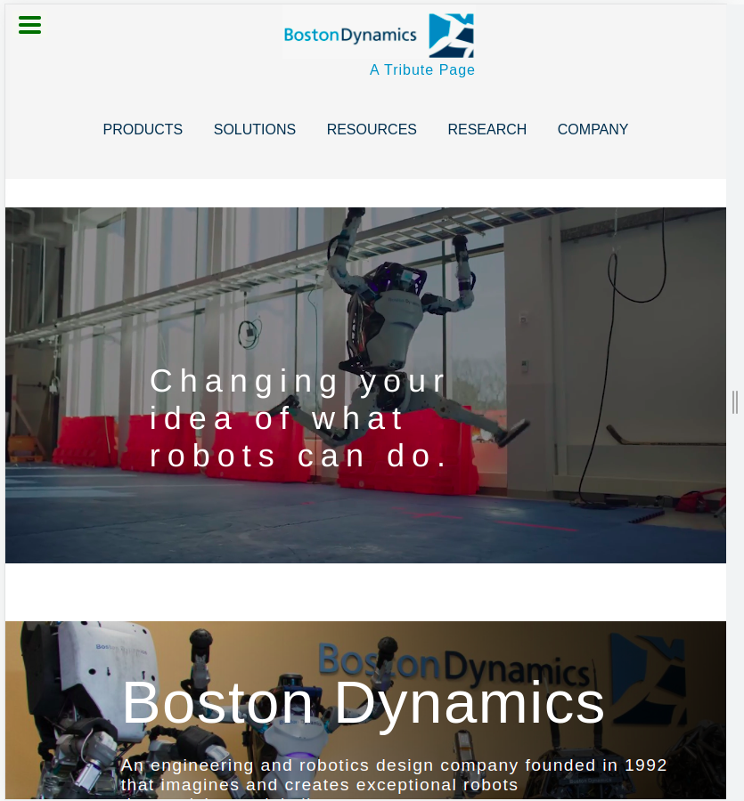

# Tribute-page - FreeCodeCamp project

### As part of my learning, I tried to get inspiration from other websites and  create replicas of their elements.

#### As part of FreeCodeCamp's Responsive Web Design course, I build a tribute page, with elements replicated from ***Boston Dynamics***.

***

#### This page uses `HTML` and `CSS` and helped me lay down the foundation for:

* Building a page markup and style elements using CSS
* Working with background images and background-blend-modes
* Using Flexbox 
* Better understanding of the box-model and positioning of elements 
* Selectors specificity
* Media queries and setting up breaking points 

#### After unexpected behaviours from the page, I gained more knowledge in: 

* Bootstrap icons 
* Difference in browsers default settings and how to normalize them

***
***

#### Check out the result:

